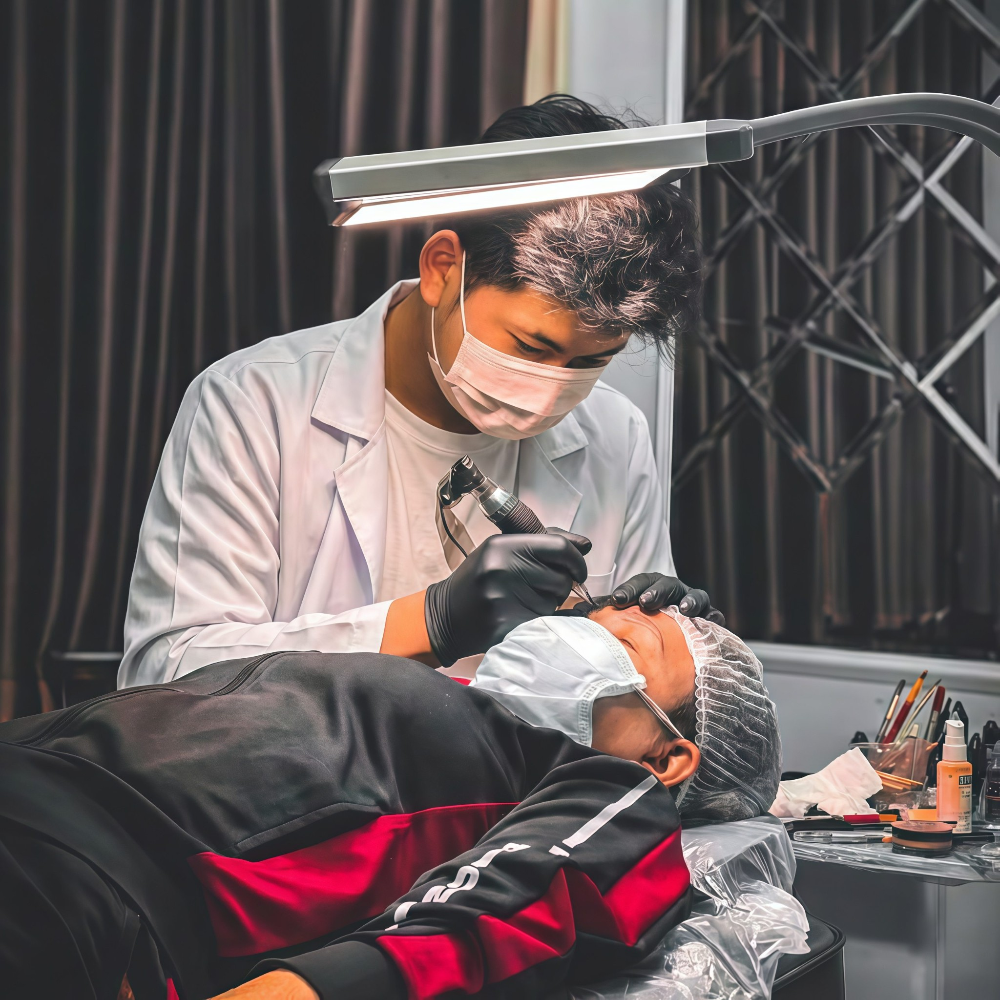
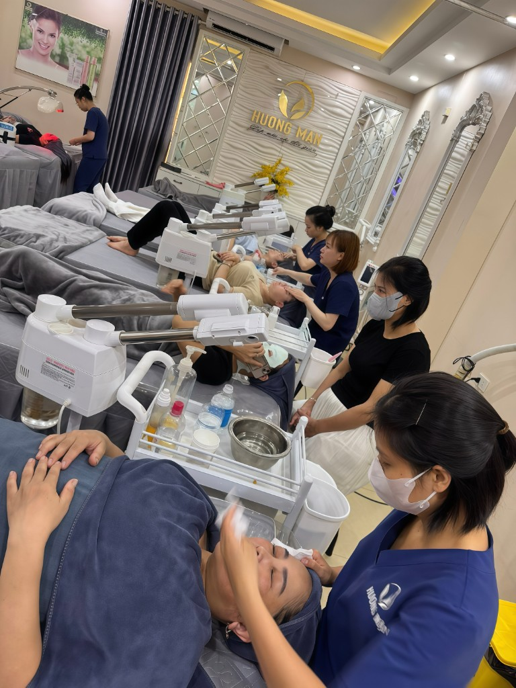
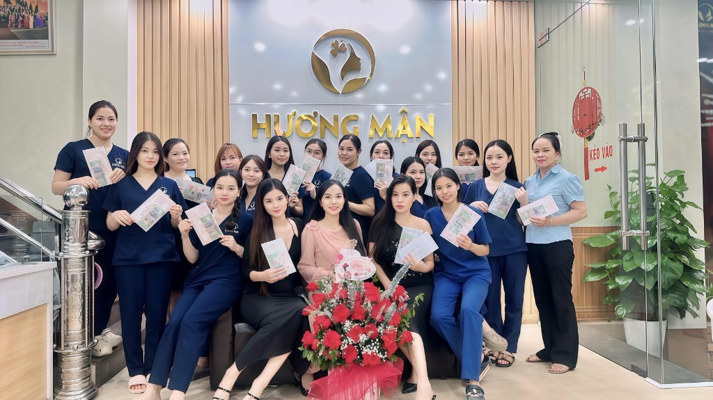

# 📝 NỘI DUNG 3 SECTIONS

## 1. 👨‍⚕️ ĐỘI NGŨ BÁC SĨ

### **Nội Dung HTML Mới:**

```html
<!-- Doctors Section -->
<section class="doctors" id="doctors">
    <div class="container">
        <div class="section-header">
            <h2>Đội Ngũ Bác Sĩ</h2>
            <p>Chuyên gia hàng đầu với bằng cấp quốc tế</p>
        </div>
        <div class="doctors-grid">
            <div class="doctor-card">
                <div class="doctor-image">
                    
                </div>
                <div class="doctor-info">
                    <h3>BS. CK1 Nguyễn Văn A</h3>
                    <p class="doctor-title">Trưởng Khoa Phẫu Thuật Thẩm Mỹ</p>
                    <ul class="doctor-credentials">
                        <li>✓ Bác sĩ Chuyên khoa 1 - Đại học Y Hà Nội</li>
                        <li>✓ Thạc sĩ Phẫu thuật thẩm mỹ - Hàn Quốc</li>
                        <li>✓ 20+ năm kinh nghiệm</li>
                        <li>✓ Hội viên Hiệp hội Phẫu thuật Thẩm mỹ Quốc tế</li>
                    </ul>
                </div>
            </div>
            
            <div class="doctor-card">
                <div class="doctor-image">
                    
                </div>
                <div class="doctor-info">
                    <h3>BS. CK2 Trần Thị B</h3>
                    <p class="doctor-title">Chuyên gia Da liễu & Thẩm mỹ da</p>
                    <ul class="doctor-credentials">
                        <li>✓ Bác sĩ Chuyên khoa 2 - Đại học Y Dược TP.HCM</li>
                        <li>✓ Chứng chỉ Laser & Công nghệ Cao - Nhật Bản</li>
                        <li>✓ 15+ năm kinh nghiệm</li>
                        <li>✓ Giảng viên Đại học Y</li>
                    </ul>
                </div>
            </div>
            
            <div class="doctor-card">
                <div class="doctor-image">
                    
                </div>
                <div class="doctor-info">
                    <h3>ThS. BS. Lê Văn C</h3>
                    <p class="doctor-title">Chuyên gia Tiêm Filler & Botox</p>
                    <ul class="doctor-credentials">
                        <li>✓ Thạc sĩ Y khoa - Singapore</li>
                        <li>✓ Chứng chỉ Filler & Botox - Allergan (Mỹ)</li>
                        <li>✓ 12+ năm kinh nghiệm</li>
                        <li>✓ Chuyên gia đào tạo kỹ thuật tiêm</li>
                    </ul>
                </div>
            </div>
        </div>
    </div>
</section>
```

---

## 2. 🏥 CƠ SỞ VẬT CHẤT

### **Nội Dung HTML Mới:**

```html
<!-- Facilities Section -->
<section class="facilities" id="facilities">
    <div class="container">
        <div class="section-header">
            <h2>Cơ Sở Vật Chất</h2>
            <p>Trang thiết bị hiện đại, không gian sang trọng</p>
        </div>
        
        <div class="facilities-intro">
            <p><strong>Thẩm Mỹ Viện Hương Mận</strong> được trang bị hệ thống máy móc, thiết bị y tế hiện đại bậc nhất, nhập khẩu 100% từ các nước có nền công nghệ thẩm mỹ hàng đầu thế giới như Hàn Quốc, Nhật Bản, Mỹ và Châu Âu.</p>
            
            <p>Không gian phòng khám được thiết kế sang trọng, tiện nghi với tiêu chuẩn vô trùng tuyệt đối, đảm bảo an toàn tối đa cho khách hàng trong suốt quá trình điều trị.</p>
        </div>
        
        <div class="facilities-grid">
            <div class="facility-card">
                <div class="facility-icon">
                    <i class="fas fa-microscope"></i>
                </div>
                <h3>Công Nghệ Tiên Tiến</h3>
                <ul>
                    <li>Ultherapy Prime (Mỹ)</li>
                    <li>Thermage FLX 900 shots (Mỹ)</li>
                    <li>Laser Pico Sure (Mỹ)</li>
                    <li>HIFU 7D Korea</li>
                    <li>RF Fractional (Israel)</li>
                </ul>
            </div>
            
            <div class="facility-card">
                <div class="facility-icon">
                    <i class="fas fa-hospital"></i>
                </div>
                <h3>Phòng Phẫu Thuật</h3>
                <ul>
                    <li>Tiêu chuẩn vô trùng quốc tế</li>
                    <li>Hệ thống điều hòa không khí HEPA</li>
                    <li>Thiết bị y tế hiện đại</li>
                    <li>Phòng hồi sức riêng biệt</li>
                    <li>Đội ngũ y tá chuyên nghiệp 24/7</li>
                </ul>
            </div>
            
            <div class="facility-card">
                <div class="facility-icon">
                    <i class="fas fa-couch"></i>
                </div>
                <h3>Phòng Chờ VIP</h3>
                <ul>
                    <li>Không gian sang trọng, riêng tư</li>
                    <li>Ghế massage thư giãn</li>
                    <li>Đồ uống miễn phí</li>
                    <li>WiFi tốc độ cao</li>
                    <li>TV & Tạp chí cao cấp</li>
                </ul>
            </div>
            
            <div class="facility-card">
                <div class="facility-icon">
                    <i class="fas fa-shield-virus"></i>
                </div>
                <h3>An Toàn & Vệ Sinh</h3>
                <ul>
                    <li>Khử trùng bằng tia UV-C</li>
                    <li>Dụng cụ vô trùng 1 lần</li>
                    <li>Kiểm soát nhiệt độ tự động</li>
                    <li>Hệ thống lọc không khí HEPA</li>
                    <li>Tuân thủ nghiêm ngặt quy định y tế</li>
                </ul>
            </div>
        </div>
        
        <div class="facility-images">
            <div class="facility-image-grid">
                
                
                
                
            </div>
        </div>
    </div>
</section>
```

---

## 3. 💬 KHÁCH HÀNG NÓI GÌ (Cập nhật)

### **Nội Dung Mở Rộng:**

```html
<!-- Testimonials Section - UPDATED -->
<section class="testimonials" id="testimonials">
    <div class="container">
        <div class="section-header">
            <h2>Khách Hàng Nói Gì</h2>
            <p>Hơn 10,000+ khách hàng tin tưởng & hài lòng</p>
        </div>
        
        <div class="testimonial-stats">
            <div class="stat-item">
                <h3>10,000+</h3>
                <p>Khách Hàng</p>
            </div>
            <div class="stat-item">
                <h3>98%</h3>
                <p>Hài Lòng</p>
            </div>
            <div class="stat-item">
                <h3>4.9/5</h3>
                <p>Đánh Giá</p>
            </div>
            <div class="stat-item">
                <h3>15+</h3>
                <p>Năm Kinh Nghiệm</p>
            </div>
        </div>
        
        <div class="testimonials-grid">
            <div class="testimonial-card">
                <div class="testimonial-header">
                    
                    <div>
                        <h4>Nguyễn Minh Châu</h4>
                        <span>Doanh nhân, 38 tuổi</span>
                    </div>
                    <div class="stars">★★★★★</div>
                </div>
                <p>"Tôi đã thử dịch vụ Ultherapy tại nhiều nơi nhưng <strong>Hương Mận là nơi tốt nhất</strong>. Bác sĩ tư vấn rất kỹ càng, quy trình chuyên nghiệp và kết quả vượt ngoài mong đợi. Sau 3 tháng, da mặt săn chắc hẳn lên, nếp nhăn mờ đi rõ rệt. Tôi sẽ quay lại!"</p>
                <div class="testimonial-service">Dịch vụ: Ultherapy Prime Full Face</div>
            </div>
            
            <div class="testimonial-card">
                <div class="testimonial-header">
                    
                    <div>
                        <h4>Lê Thị Hương</h4>
                        <span>Giáo viên, 42 tuổi</span>
                    </div>
                    <div class="stars">★★★★★</div>
                </div>
                <p>"Sau 10 năm chịu đựng vết nám dai dẳng, tôi đã tìm đến Hương Mận. Liệu trình <strong>Laser + Peel da y tế</strong> mang lại kết quả không ngờ. Chỉ sau 2 tháng, da đã sáng đều màu, nám mờ 80%. Cảm ơn đội ngũ bác sĩ đã giúp tôi lấy lại tự tin!"</p>
                <div class="testimonial-service">Dịch vụ: Trị Nám Chuyên Sâu</div>
            </div>
            
            <div class="testimonial-card">
                <div class="testimonial-header">
                    
                    <div>
                        <h4>Trần Văn Minh</h4>
                        <span>Kiến trúc sư, 35 tuổi</span>
                    </div>
                    <div class="stars">★★★★★</div>
                </div>
                <p>"Là nam giới, tôi khá ngại khi đến thẩm mỹ viện. Nhưng <strong>Hương Mận làm tôi cảm thấy thoải mái</strong> ngay từ lần đầu. Dịch vụ nâng mũi bằng filler kết quả tự nhiên, không ai nhận ra. Đội ngũ rất chuyên nghiệp và kín đáo."</p>
                <div class="testimonial-service">Dịch vụ: Nâng Mũi Filler</div>
            </div>
            
            <div class="testimonial-card">
                <div class="testimonial-header">
                    
                    <div>
                        <h4>Phạm Thu Hà</h4>
                        <span>Marketing Manager, 29 tuổi</span>
                    </div>
                    <div class="stars">★★★★★</div>
                </div>
                <p>"Tôi làm <strong>Thermage FLX 900 shots</strong> tại Hương Mận. Ban đầu lo sợ đau nhưng hoàn toàn không đau như nghĩ! Bác sĩ bắn rất kỹ, tư vấn từng bước. Sau 1 tháng, da căng mịn, V-line rõ nét. Giá cả hợp lý so với chất lượng dịch vụ!"</p>
                <div class="testimonial-service">Dịch vụ: Thermage FLX</div>
            </div>
            
            <div class="testimonial-card">
                <div class="testimonial-header">
                    
                    <div>
                        <h4>Ngô Thanh Tâm</h4>
                        <span>Ca sĩ, 26 tuổi</span>
                    </div>
                    <div class="stars">★★★★★</div>
                </div>
                <p>"Công việc yêu cầu tôi phải luôn xinh đẹp trên sân khấu. <strong>Hương Mận là thẩm mỹ viện tôi tin tưởng</strong> cho các dịch vụ chăm sóc da định kỳ. Skin Booster, Botox... đều rất tốt. Đặc biệt là sản phẩm chăm sóc da tại nhà cũng chất lượng cao."</p>
                <div class="testimonial-service">Dịch vụ: Chăm Sóc Da VIP</div>
            </div>
            
            <div class="testimonial-card">
                <div class="testimonial-header">
                    
                    <div>
                        <h4>Đỗ Minh Tuấn</h4>
                        <span>CEO, 45 tuổi</span>
                    </div>
                    <div class="stars">★★★★★</div>
                </div>
                <p>"Ở tuổi 45, tôi cần giải pháp <strong>trẻ hóa da toàn diện</strong>. Hương Mận tư vấn combo HIFU + Laser + Botox phù hợp ngân sách. Kết quả: trông trẻ hơn 10 tuổi! Đồng nghiệp ai cũng hỏi bí quyết. Phòng VIP riêng tư, phù hợp doanh nhân bận rộn như tôi."</p>
                <div class="testimonial-service">Dịch vụ: Gói Trẻ Hóa Da VIP</div>
            </div>
        </div>
        
        <div class="testimonial-cta">
            <p><strong>Bạn muốn chia sẻ trải nghiệm của mình?</strong></p>
            <button class="btn-testimonial" onclick="openBooking()">Đặt Lịch Tư Vấn Miễn Phí</button>
        </div>
    </div>
</section>
```

---

## 📋 TÓM TẮT

### **3 Sections Đã Viết:**

1. **Đội Ngũ Bác Sĩ:**
   - 3 bác sĩ profile cards
   - Bằng cấp, kinh nghiệm chi tiết
   - Chuyên môn rõ ràng

2. **Cơ Sở Vật Chất:**
   - 4 feature cards (Công nghệ, Phòng phẫu thuật, Phòng VIP, An toàn)
   - Danh sách thiết bị cụ thể
   - 4 ảnh minh họa

3. **Khách Hàng Nói Gì:**
   - 4 stats (10K+ khách hàng, 98% hài lòng, 4.9/5, 15+ năm)
   - 6 testimonial cards chi tiết
   - Avatar, tên, tuổi, nghề nghiệp
   - Review cụ thể về dịch vụ
   - CTA cuối section

**Tất cả đã có placeholder images & fallback URLs!** 🎉
